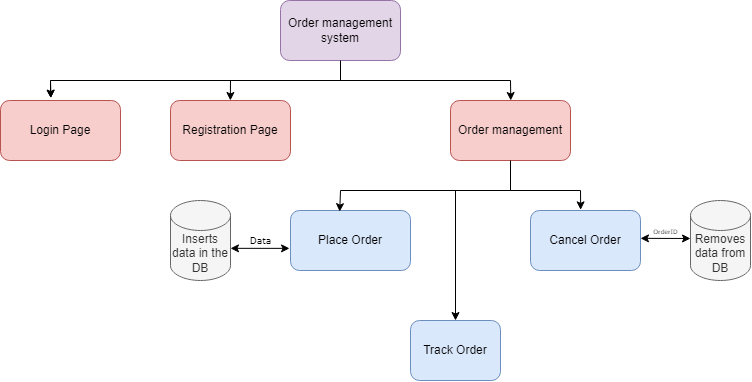

# About
This project is used to create and place orders. Orders created are stored in database. Orders can be deleted by orderID.

## Tech
- Python
- Tkinter
- SQLite3

## How to run
- Clone the project and  open in VSCode
- Run Code

## Flow chart
